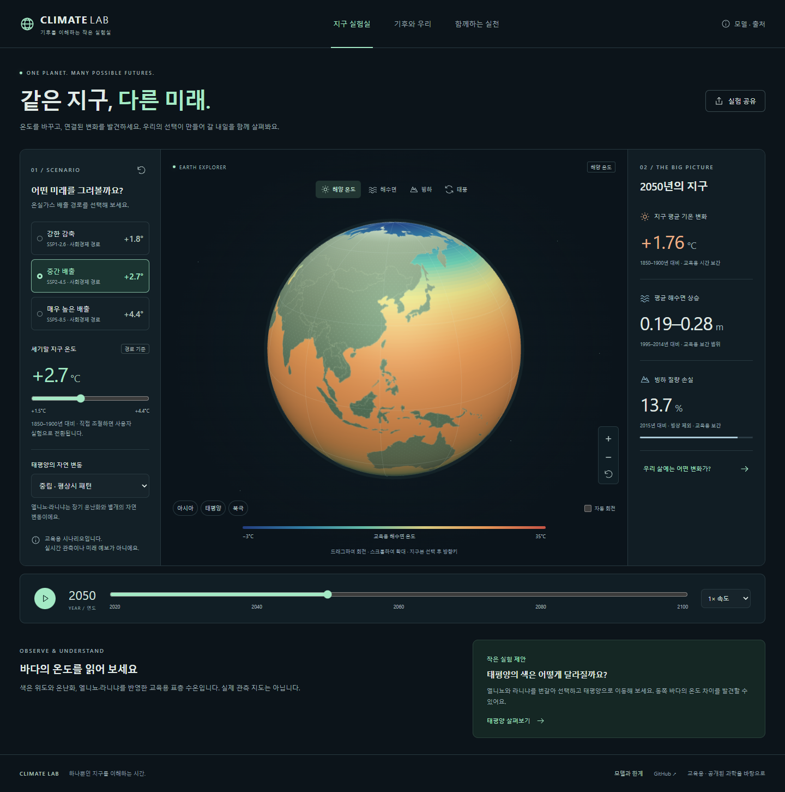

# Climate Lab · 기후 실험실

[English](README.md) | **한국어**

GitHub Pages에서 실행하는 한국어 중심 기후 학습 웹사이트입니다. 지구본, 온난화 시나리오, 해수면, 빙하 감소, 엘니뇨·라니냐, 태풍 생성 조건, 기후 위험, 일상 속 실천을 탐색합니다.



## 실행 계획

1. 영어와 한국어로 동일한 아키텍처, 모델, 출처, 검증, 배포, 기여 문서를 만듭니다.
2. 로컬 지리 자료를 사용하는 정적 Vite + TypeScript + Three.js 앱을 구현합니다. 실행 중 외부 서비스는 필요하지 않습니다.
3. 출처가 있는 기후 참고 수치와 교육용 해양·태풍·홍수·감염병 환경 적합도 모델을 구분합니다.
4. 접근 가능한 조작, 시나리오 비교, 시간 재생, 설정 공유, 로컬 실천 체크리스트를 추가합니다.
5. 수치 불변 조건, 데스크톱·모바일 조작, 스크린샷, 로컬 자산, 양언어 문서를 검증합니다.
6. GitHub Actions 검증 및 Pages 배포를 준비하고 개발 기록에 실제 결과를 남깁니다.

구현 6단계를 로컬에서 완료했습니다. 초기 검증에서 단위 테스트 23개와 데스크톱·모바일 브라우저 시나리오 24개가 통과했습니다. 시각 표현 개편과 최신 검증 결과는 개발 기록에 있습니다. 실제 결과와 공개 배포 한계는 [개발 기록](docs/ko/development-log.md)에 있습니다. 기존 Apache-2.0 라이선스를 유지합니다.

## 기능

- **인터랙티브 3D 지구본:** 드래그·확대·방향키 회전·아시아/태평양/북극 이동·선택적 자동 회전.
- **시나리오 실험실:** IPCC 참고 경로 3개, 사용자 목표 1.5–4.4°C, 2020–2100년 시간축·재생/정지·속도·초기화.
- **시각 레이어 4개:** 가상 해양 수온, 기호로 표현한 해수면·해안 변화, 빙하 기준 윤곽과 큰 후퇴 비교 그림, 별도의 30일 이동 실험을 제공하는 태풍 구름.
- **날씨 실험:** 눈·눈벽·나선형 구름, 지나온 경로, 육지·차가운 바다에서의 약화, 동일 설정 재현. 후보 고정 모드와 온난화에 따라 후보·경로 굴곡을 늘리는 가상 극한 모드를 선택합니다. 실제 태풍 빈도 전망이 아닙니다.
- **엘니뇨·라니냐:** 장기 온난화와 독립적으로 적도 태평양 수온 편차의 부호 변경.
- **기후와 우리:** 출처 기반 극한 강수 상대 빈도, 교육용 풍수해 노출 점수, 비단조 매개체 적합도 그래프, 대비 수준 조작, 경로 비교.
- **함께하는 실천:** 한국어 일상 실천 카드 6개와 로컬 체크리스트. 체크가 배출을 상쇄하거나 지구 온도를 바로 바꾼다고 표시하지 않습니다.
- **공유와 내보내기:** 모든 실험 설정을 재현하는 링크와 수치·가정·출처를 담은 JSON. 백엔드나 실시간 다중 사용자 서비스는 없습니다.
- **반응형·복구:** 데스크톱/모바일 배치, 키보드 포커스, 기본 대화상자, 동작 줄이기 지원, WebGL 복구, 3D 없이 계속 사용 가능.

## 로컬 실행

Node.js 22.12 이상이 필요합니다.

```sh
npm ci
npm run dev
```

Vite가 출력하는 로컬 주소(보통 `http://127.0.0.1:5173`)를 엽니다. API 키·백엔드·지도 계정·외부 글꼴이 필요하지 않습니다. 앱 자산은 모두 로컬에 있습니다. `file://`가 아닌 웹 서버를 사용하세요.

```sh
npm run format
npm run check
npx playwright install chromium
npm run test:e2e
npm run preview
```

브라우저 검증은 4193 포트의 `/global_warming_simulation/`에서 프로덕션 빌드를 제공합니다. [검증 절차](docs/ko/harness-engineering.md)와 실제 결과를 기록한 [개발 기록](docs/ko/development-log.md)을 참고하세요.

## 첫 실험

1. 2100년을 선택하고 **강한 감축**과 **매우 높은 배출**을 비교합니다. 해수면 범위와 남은 빙하 질량을 살펴봅니다.
2. **태평양**으로 이동하고 **엘니뇨**와 **라니냐**를 번갈아 선택합니다. 따뜻하거나 차가운 영역은 장기 경로와 독립적으로 바뀝니다.
3. **태풍**을 선택합니다. 별도의 30일 날씨 슬라이더로 생성·이동·쇠퇴를 확인합니다. 후보 고정과 극한 모드를 비교한 뒤 시어를 높이거나 위도를 0으로 바꿔 생성 조건을 실험합니다.
4. **기후와 우리**에서 대비 수준을 높입니다. 물리적 기후값은 그대로이며 노출 점수만 낮아집니다.
5. **함께하는 실천**에서 가능한 행동을 고르고 공개된 사이트에서 실험을 공유합니다.

처음 열거나 공유 링크로 접속하면 시간은 정지 상태입니다. 태풍 레이어를 누르면 동작 줄이기 설정이 없는 경우 날씨 이동을 시작하며 이동 재생 버튼으로도 직접 시작할 수 있습니다. 기후 연도와 날씨 재생은 서로를 일시정지합니다. 2100년에서 다시 재생하면 2020년으로 돌아갑니다. 수치 슬라이더를 바꾸면 재생이 정지합니다. 브라우저 탭 숨김·대화상자 열기·화면 전환도 재생을 중단합니다. 공유 주소에는 설정이 들어가며 개인 체크리스트·카메라 방향은 포함하지 않습니다.

## 수치의 의미

이 앱은 예측용 지구 시스템 모델이 아닌 교육용 참고 수치 탐색 도구입니다. 출처가 있는 종점과 자체 보간을 표시합니다. 해수면 기준은 1995–2014년, 온난화는 1850–1900년, 빙하 질량은 빙상을 제외한 2015년입니다. 선택한 기간 평균 목표를 개념적인 2100년 종점으로 다룹니다.

실제 지역의 홍수 발생률이나 감염병 발생률 백분율은 **추정하지 않습니다**. 여기에는 지역 관측·노출 인구·보정된 모델이 필요합니다. 대신 극한 강수 상대 빈도·가상 풍수해 노출·교육용 매개체 환경 적합도를 구분해 표시합니다. 실제 태풍 개수·개별 빙하 소멸 날짜·실제 침수 지도를 예측하지 않습니다. 날씨 실험은 자체 제작 후보와 경로를 표시하며 가정은 [날씨 모델](docs/ko/weather-model.md)에 있습니다. [전체 수식과 생략 사항](docs/ko/climate-model.md)을 참고하세요.

## GitHub Pages

포함된 워크플로는 검증 후 `main`에서 `dist/`를 배포합니다. 먼저 [저장소 Settings → Pages](https://github.com/hundong2/global_warming_simulation/settings/pages)에서 **GitHub Actions**를 선택합니다. push·병합·공개 배포는 허가가 필요하며, 이 구현만으로 Pages가 활성화되지는 않습니다.

배포 성공 후 예상 주소: [Climate Lab](https://hundong2.github.io/global_warming_simulation/). 예상 배포 주소이며 이미 공개되어 있다는 주장이 아닙니다. [한국어 배포 안내](docs/ko/deployment.md) 또는 [English deployment guide](docs/deployment.md)를 따르세요.

## 문서

영어가 기본 언어입니다. 모든 문서에 동등한 한국어판과 상호 언어 링크가 있으며 제품 화면은 한국어입니다.

| 주제               | English                                             | 한국어                                       |
| ------------------ | --------------------------------------------------- | -------------------------------------------- |
| 소개와 사용법      | [README](README.md)                                 | [소개와 사용법](README.ko.md)                |
| 기여자 지침        | [Instructions](AGENTS.md)                           | [작업 지침](AGENTS.ko.md)                    |
| 아키텍처           | [Architecture](docs/architecture.md)                | [아키텍처](docs/ko/architecture.md)          |
| 기후 모델과 한계   | [Model guide](docs/climate-model.md)                | [기후 모델과 한계](docs/ko/climate-model.md) |
| 날씨와 시각적 축척 | [Weather model](docs/weather-model.md)              | [날씨 모델](docs/ko/weather-model.md)        |
| 출처와 라이선스    | [Sources](docs/sources.md)                          | [출처와 라이선스](docs/ko/sources.md)        |
| 검증               | [Development workflow](docs/harness-engineering.md) | [검증 절차](docs/ko/harness-engineering.md)  |
| GitHub Pages       | [Deployment](docs/deployment.md)                    | [배포 안내](docs/ko/deployment.md)           |
| 계획과 결과        | [Development log](docs/development-log.md)          | [개발 기록](docs/ko/development-log.md)      |

## 프로젝트 구조

```text
.github/workflows/      CI와 검증 후 GitHub Pages 배포
src/simulation/        순수 기후 참고값·보간 모델
src/render/            지구본·생성 텍스처·카메라·복구
src/ui/                한국어 설명·아이콘·디자인 토큰
src/main.ts            앱 상태와 사용자 조작
public/data/           로컬 Natural Earth 지리
tests/unit/            연구 참고값·불변 조건 검사
tests/e2e/             데스크톱·모바일 브라우저 시나리오
scripts/               하위 경로 서버·빌드/문서 검사
docs/                  영어 문서
docs/ko/               동등한 한국어 문서
```

## 라이선스

기존 [Apache License 2.0](LICENSE)을 유지합니다. Natural Earth는 퍼블릭 도메인입니다. 다른 의존성과 참고 출처는 [출처 문서](docs/ko/sources.md)에 기록합니다.
